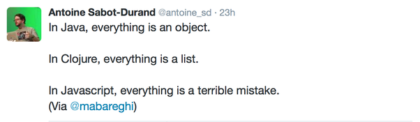

## Javascript so far
When I first began my journey into programming, I foolishly believed that Java and Javascript were one in the same. Boy, was I wrong. Through a simple Google search I came across the quote, "Java and Javascript are similar like Car and Carpet are similar". Prior to taking ICS 314, I only had experience with Java, C, C++ and Python, so this is my first go at using an interpreted language. I've seen the never-ending complaints and jokes made about Javascript by people on the web; it's too slow, not secure, lacks control etc. But in my limited, one-week experience with the language, I have no qualms with the language and find it incredibly user-friendly so far. 

Just like Python, it is dynamically typed, making it easier for me to pick up and quickly write a rudimentary program. Although this is neat at first, I can see how it can be ultimately detrimental when code gets larger and more complex, especially if applied to an extensive software engineering project. In my experience with Python, dynamic typing caused me to have uncaught typos and other errors that weren't realized until I was farther along in a project.  

## WODS: Stressful but helpful
Working under pressure has always proved difficult for me, so when I first heard of Workout of the day (WODS), I was petrified. The practice WODS assigned for homework and the one we had in class changed my perspective. Knowing what to expect and having beeen able to complete all the WODS in the time constraint gave me the confidence I needed. I know that the challenges will only get harder from here on out, but I understand that working under a strict time limit will be something I will face in the future when applying for jobs. 
